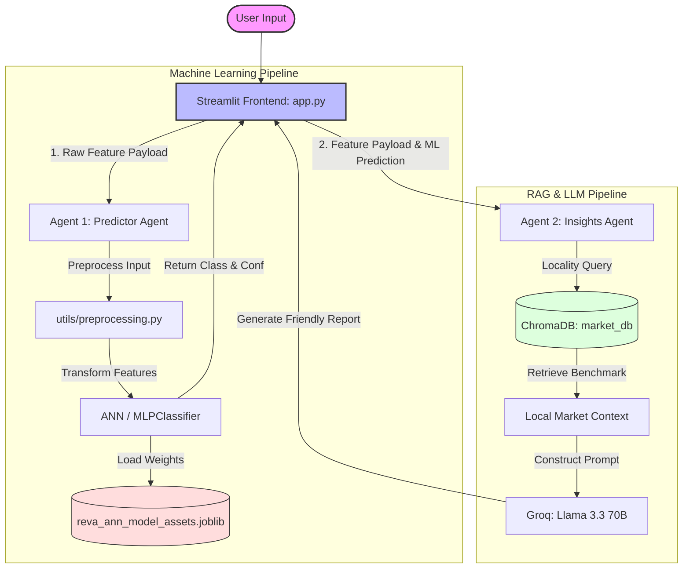

# 🏠 Reva AI: Institutional Grade Real Estate Valuation Engine

**Reva AI** is a cutting-edge, dual-agent real estate intelligence system designed for the Pakistan housing market. It combines **Machine Learning (Artificial Neural Networks)** with **Retrieval-Augmented Generation (RAG)** to provide accurate property valuation classifications alongside professional, context-aware strategic market insights.

---

## 🏗️ Architecture Overview

Reva AI utilizes a multi-agent framework to evaluate properties and explain its assessments:



---

## 🌟 Key Features

### 1. 🤖 Agent 1: Predictor Agent (Machine Learning Engine)
An Artificial Neural Network (MLPClassifier) trained via `scikit-learn` to classify properties into three distinct price brackets:
*   **Low Tier**: Under 7,000,000 PKR (< 70 Lakhs)
*   **Medium Tier**: 7,000,000 to 22,000,000 PKR (70 Lakhs - 2.2 Crore)
*   **High Tier**: Above 22,000,000 PKR (> 2.2 Crore)

**Pipeline Highlights:**
*   **Outlier Removal**: Uses Interquartile Range (IQR) filtering on property price and area to ignore noise.
*   **Data Preparation**: Discards ambiguous borderline price points to enforce clear classification boundaries.
*   **Feature Engineering**: Implements custom feature derivations like `total_rooms` and mathematical location frequencies (`location_freq`).
*   **ColumnTransformer**: Dynamically scales numerical features using `StandardScaler` and encodes categorical values via `OneHotEncoder`.

### 2. 📚 Agent 2: Insights Agent (Retrieval-Augmented Generation)
Explains predicted valuations to users in plain, friendly language using advanced natural language processing.
*   **Vector Database (ChromaDB)**: Houses locally-embedded market benchmarks utilizing the `all-MiniLM-L6-v2` sentence transformer model.
*   **Groq Inference**: Interacts with the `llama-3.3-70b-versatile` model to provide detailed narratives, citing exact pricing benchmarks, regional factors (e.g. DHA, Bahria Town premiums), and custom property advice.

### 3. 🎨 Streamlit Interface
A sleek, responsive, and visually appealing web application that serves as the frontend for entering property features, displaying prediction confidence metrics, and presenting market reports in clean expandable layouts.

---

## 📂 Directory Structure

```bash
Proj-AI/
├── agents/
│   ├── __init__.py
│   ├── Insights_agent.py          # Handles vector retrieval, prompts & Groq API requests
│   └── Predictor_agent.py         # Performs ANN prediction & confidence scores
├── utils/
│   ├── __init__.py
│   ├── constants.py               # Predefined city mappings & dropdown structures
│   └── preprocessing.py           # Preprocessing routines for raw input
├── backend.py                     # Multi-classifier comparisons & model training script
├── generate_knowledge.py          # Builds RAG textual knowledge base from raw csv
├── app.py                         # Streamlit UI definition and application runner
├── requirements.txt               # Project library dependencies
├── market_knowledge.txt           # Generated RAG source document
├── reva_ann_model_assets.joblib   # Serialized ML assets (scaler, encoder, ANN model)
└── market_db/                     # Local persistent ChromaDB vector store
```

---

## 🚀 Setup & Installation

Follow these steps to run Reva AI on your local environment:

### 1. Clone & Navigate
```bash
git clone 
cd Proj-AI
```

### 2. Create and Activate Virtual Environment
```bash
# Windows
python -m venv venv
venv\Scripts\activate

# macOS / Linux
python3 -m venv venv
source venv/bin/activate
```

### 3. Install Dependencies
```bash
pip install -r requirements.txt
```

### 4. Configure Environment Variables
Create a file named `.env` in the root folder of the project and add your Groq API key:
```env
GROQ_API_KEY=your_actual_groq_api_key_here
```

### 5. Build Knowledge Base & RAG Vector Database
To construct the local real estate benchmarks and populate the vector store, run:
```bash
python generate_knowledge.py
```

### 6. Run the Application
Start the Streamlit interface:
```bash
streamlit run app.py
```
A new tab should automatically open in your default browser at `http://localhost:8501`.

---

## 🛠️ Re-Training the Model (Optional)
If you wish to re-train the underlying machine learning model, simply execute the backend training script:
```bash
python backend.py
```
This script will evaluate 4 different classifiers (Logistic Regression, ANN, Random Forest, Gaussian Naive Bayes), compare their metrics (Accuracy, Precision, Recall, F1), and save the updated neural network weights directly to `reva_ann_model_assets.joblib`.
